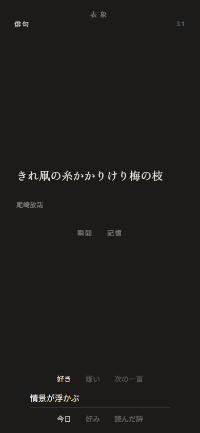
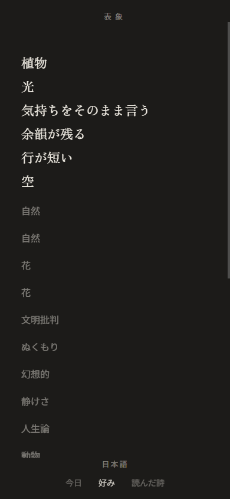
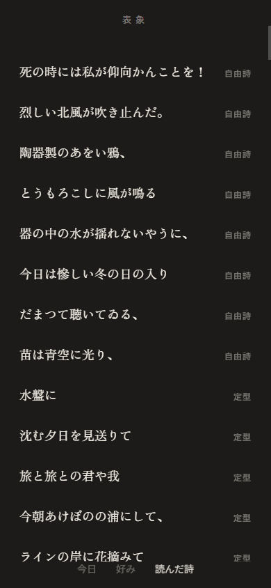
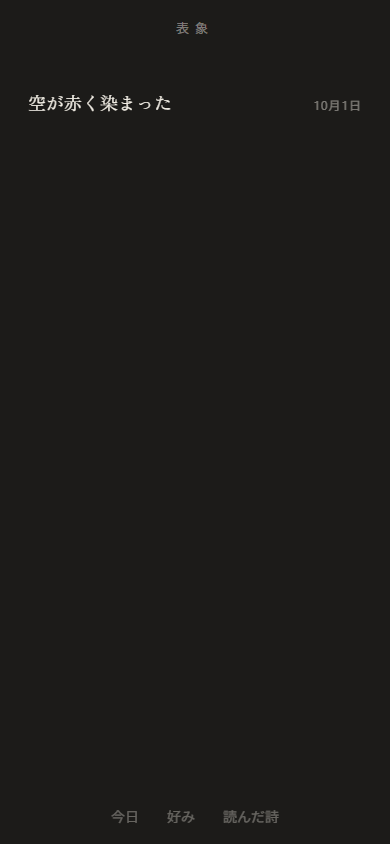
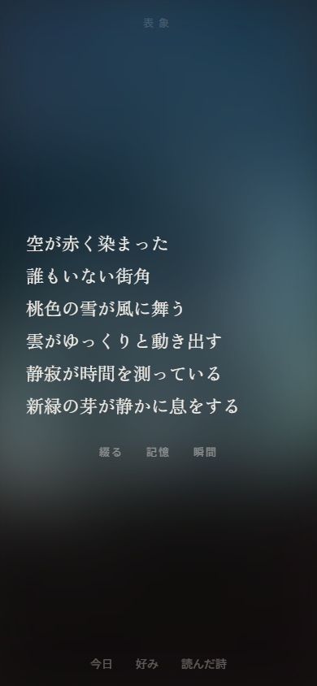

# 表象 / representation

表象は、パブリックドメインの自由詩、俳句、短歌、定型を静かに読むためのアプリです。一首ずつ読みながら、好き嫌いや、その理由を手元に残せます。

はじめは日本語と英語が混ざって届きます。自由詩と定型は日本語と英語が交互に、俳句と短歌は日本語で現れます。日本語だけ、英語だけに切り替えることもできます。

好き嫌いが溜まると、写真を指定して詩を創作させることができるようになります。

製品の詳しい仕様は [PLAN.md](PLAN.md)、見た目と動きは [design.md](design.md)、実装するときの約束は [AGENTS.md](AGENTS.md) にまとめています。

## 画面

下の「今日」「好み」「読んだ詩」を行き来します。写真から届いた一首は「記憶」に残り、そこから開きます。

| 今日 | 好み |
| :---: | :---: |
|  |  |
| 一首を読んで、好きか嫌いか、その理由を残します。 | 残した理由が並びます。言語もここで選びます。 |

| 読んだ詩 | 記憶 |
| :---: | :---: |
|  |  |
| 読んだ順に、最初の一行と型が並びます。 | 届いた一首を、新しい日から並べます。 |

届いた一首は、選んだ写真の色を背景にして読みます。「綴る」でその日の本文を書き換えられます。



## 起動

Node.js 22.13 以降、または 24.3 以降と npm を用意し、次のコマンドを実行します。

```bash
npm install
npm run web
```

ブラウザで `http://localhost:8081` が開きます。「今日」「好み」「読んだ詩」の三つの画面を行き来できます。

読んだ位置や残した反応は、使っている端末の中だけに保存されます。詩の本文は `data/poems.json` に同梱しているため、読むための通信は必要ありません。

### スマートフォンで試す

スマートフォンでは Expo Go（SDK 57 対応版）を使います。PC とスマートフォンを同じ Wi-Fi に接続し、起動中の開発サーバーがあれば止めてから、次を実行してください。

```bash
npm start
```

ターミナルに表示された QR コードを読み取ります。Android は Expo Go の「Scan QR code」から、iPhone は標準のカメラから開けます。

WSL2 などで接続しにくいときは、トンネルを利用できます。初回だけ、トンネル用パッケージの取得にネットワーク接続を使います。

```bash
npx expo start --tunnel
```

## テスト

次の一首の選び方、写真から取り出す断片、届ける時刻、生成した詩の形をまとめて確かめます。

```bash
npm test
```

## 詩の同梱

収録する詩は、青空文庫か Project Gutenberg の公開ファイルから切り出しています。データを作り直すときは、次のコマンドを使います。この処理にはネットワーク接続が必要です。

```bash
node scripts/extract-poems.mjs
```

## 手元で一首を届ける

写真から詩が届く流れも、ローカルで試せます。詳しい仕組みは [docs/photo-pipeline.md](docs/photo-pipeline.md) にあります。

注文を受けるコンテナと Ollama を、次のコマンドで一緒に起動します。

```bash
docker compose up --build
```

Web アプリは、開いているホストの `8787` 番ポートへ注文を送ります。別の接続先を使う場合は、`EXPO_PUBLIC_ORDER_URL` を設定してください。

ローカル環境では `qwen3.5:4b` を使い、できたときに一首が届きます。一日の上限は外してあり、同じ日の新しい一枚がその日の一行を上書きします。写真の画素は外へ送りません。

好きが十五首たまると、「今日」の詩の下に「瞬間」が現れます。そこから一枚を選ぶと、あとから一首が届きます。届いた詩は「記憶」に日ごとに残り、「綴る」から本文を書き換えられます。書き換えた文は端末の中だけに残り、好みの計算には使いません。

記憶から開いた一首で「瞬間」を押すと、「創作のために詩を外部へ送信します。サーバーへの送信データは創作後に削除されます。」と出ます。その文を押すと写真を選べ、その日の本文が見本として一緒に送られます。見本は創作のあと捨てられ、好みには使いません。同じ日にもう一度送ろうとすると、「詩の創作は1日1回までです。」と出ます。今日の画面の「瞬間」が送るのは、写真から取り出した断片と、自由詩の言うことの得点だけです。
