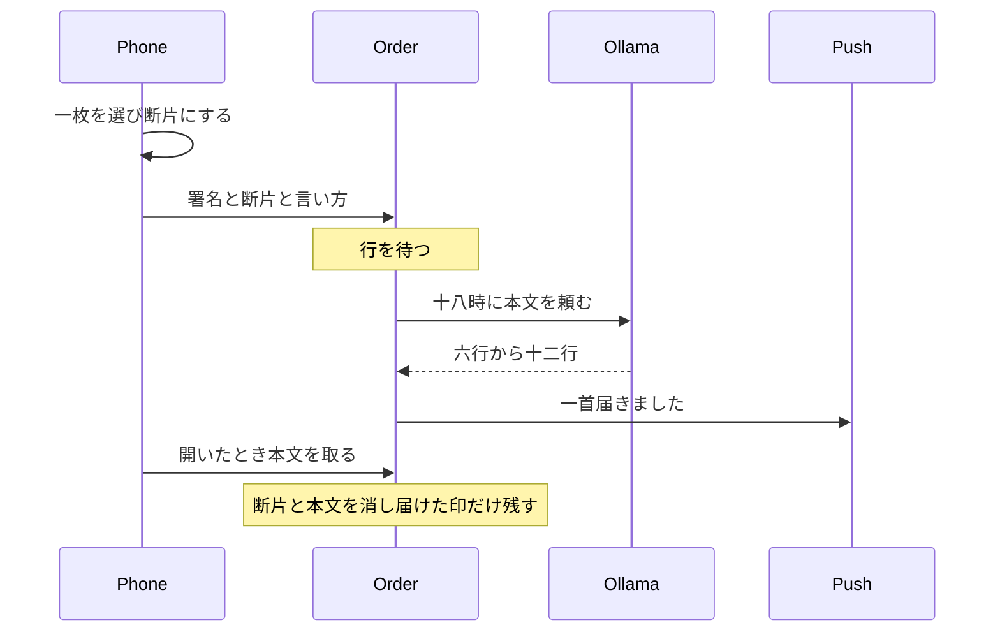

# 写真の通り道

製品の線は [PLAN.md](../PLAN.md) の「写真から届く一首」のままである。この文書は、その一首が端末から戻るまでの通り道だけを書く。

## 全体

待ち行列の製品は置かない。一アカウント一日一行が、待ち行列そのものである。注文は、すでに契約している Railway（8 GB RAM、8 vCPU、100 GB の共有ディスク）の、スリープしない小さなコンテナに置く。Ollama 用の Railway とは別契約である。

記録は共有ディスク上の SQLite である。五分ごとのループはコンテナの中で回り、届ける時刻を過ぎた行だけを起こす。Expo の push HTTP を呼ぶ。POST と GET も同じコンテナの経路である。他のアプリの再起動と運命を共有するので、生成の途中で落ちても状態「作る」から一度だけやり直す。9b はこの 8 GB には載せず、メモリは注文と、すでに載っているアプリに残す。

この Railway は Hobby である。2026-09-16 から 2026-10-16 の使用量は、途中の 10 月 1 日時点で 1.85 ドル、含まれる使用量は 5 ドル、見積もり請求は 0 ドルである。コンピュートの上限は 10 ドルで、その時点の使用は 1.83 ドルである。注文コンテナはスリープさせない。メモリを小さく保ち、この含まれる 5 ドルの内側に収める。

モデルは、他のスモールアプリと共有する Ollama コンテナに置く。本番は別契約の Railway、ローカル開発は同じモデル名を入れた Docker の Ollama である。既定のモデル名は `qwen3.5:9b` である。小さいモデルにするときは `qwen3.5:4b` を、同じ口の設定で切り替える。利用者ごとの切り替えにはしない。注文コンテナは `OLLAMA_BASE_URL` へ同じ HTTP を送る。別契約なので内部網は使わず、公開の HTTPS と共有の秘密で呼ぶ。コンテナは公開のままにしない。ローカルではその URL が手元のコンテナの口になる。手元の compose は、同じ口のまま届け時刻を今にし、ループを五分より短くして、注文の直後にこの流れを通せる。届け時刻の初期値は現地の十八時、間隔の初期値は五分である。モデル名を空けると `qwen3.5:9b`、手元の compose は `qwen3.5:4b` を入れる。

口は三つに分ける。利用者の POST は断片を行に書くだけで、モデルは呼ばない。十八時の生成は五分ループが行い、利用者のリクエストではない。本文を取る GET は、できたあとの行を読むだけである。

- `POST /orders` は、署名、現地の日付、時刻帯、push トークン、断片、言うことの得点、言語を受ける。成功は行を「待つ」にしたことだけを返す。本文は返さない。
- 五分ループは、届ける時刻を過ぎた「待つ」行を起こし、モデルを呼び、push する。
- `GET /orders/today` は、署名だけを受け、状態が「届ける」のとき本文を返し、渡したあとに本文を消す。

## 端末

一枚は `expo-image-picker` のシステム選択で取る。ロールの許可は求めない。

断片は端末内の画像分類で取り、送る前に閉じた語へ潰す。語は [domain/types.ts](../domain/types.ts) の見ること、人がいるかどうか、季節（春夏秋冬のいずれか）だけである。分類器の生のラベル一覧は送らない。季節は写っているものから取り、日付では埋めない。

書類とスクリーンショットは、端末内の文字認識で、文字の占める面積が大きいものを拒む。そのときは何も送らない。ロールの種別は見えないので、この判定は完全ではない。

言い方は、自由詩の反応から [domain/selectNext.ts](../domain/selectNext.ts) の得点を作り、その「言うこと」だけを送る。理由の文章は送らない。言語は、英語だけのとき英語、それ以外は日本語にする。一首しか届かないので、混合でも交互はしない。

十五時の判定は端末の現地時刻で行う。送るのは、現地の日付、時刻帯、届け先トークン、断片、言うことの得点、言語である。

## 署名と行

iOS は Apple の identity token、Android は Google の ID token を、それぞれの公開鍵で検証する。アカウントは発行者と subject の組だけにする。メールは置かない。

行はアカウントと現地日付で一つである。項目は、時刻帯、届ける UTC 時刻、push トークン、断片、言うことの得点、言語、状態、試行回数、本文である。状態は、待つ、作る、届ける、渡した、失敗、である。

十五時より前の再指定は、まだ「待つ」のときだけ断片を上書きする。すでにその日の一首を渡しているときは、新しい指定を受けない。

## 十八時の仕事

モデルの重みは注文コンテナの中には置かない。五分ループが Ollama の文章 API を HTTP で呼ぶ。呼ぶモデル名の既定は `qwen3.5:9b`、小さいときは `qwen3.5:4b` である。ローカルの Docker と Ollama 用 Railway は、同じモデル名と同じリクエストであれば、同じ口として扱える。差が出るのは、メモリに載る量子化、起動後の初回の読み込み、応答の速さである。

五分ごとに、届ける時刻を過ぎた「待つ」行を取る。状態を「作る」にしてから、その API を呼ぶ。本文が六行から十二行で、箇条書きや物の一覧でないときだけ採用する。外れたときは、同じ指定でもう一度だけ呼ぶ。二度とも外れたら「失敗」にし、その日は届かない。通知はしない。

採用したら断片を消し、本文を行に残し、状態を「届ける」にする。Push の本文は「一首届きました」だけである。詩は data にも入れない。Push が失敗しても、行は「届ける」のまま残す。

アプリは起動時と、通知を開いたときに、その日の本文を取りに来る。渡したあと本文を消し、状態だけ「渡した」にする。翌日以降、サーバーに詩は残らない。届けた印は、その日の二首目を拒むために、現地日付が変わるまで残す。
